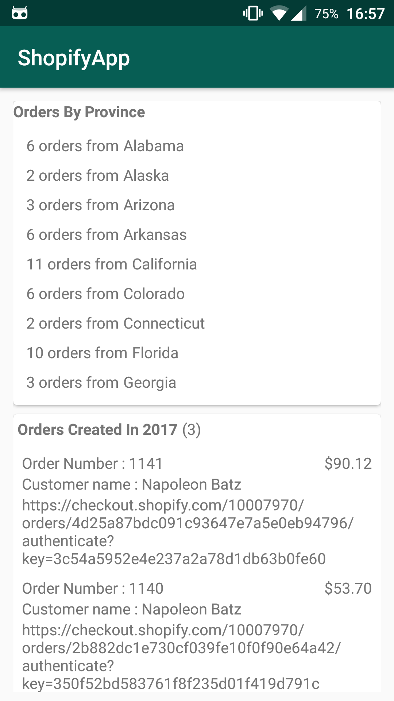

# ShopifyApp

A basic Android app for the Shopify mobile challenge. Built using MVP architecture and Retrofit and OkHTTP for the network call.

A short video of the app in action can be downloaded here : https://github.com/ambardhesi/ShopifyApp/blob/master/device-2018-05-03-040705.mp4

Screenshot : 

  

